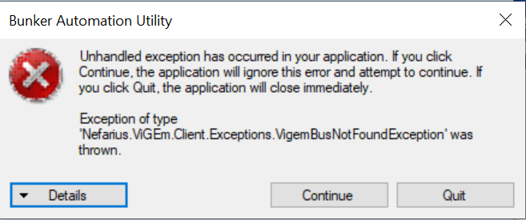

# Bunker-Automation-Utility
This is a tool for automating bunker supplies and going afk while you are away from your PS4. No ads, Free updates and bug fixes.

## NOTE: THIS IS IN BETA NOW. IT MAY LEAD TO LOSS OF MONEY OR TIME.
## Get the latest version [here](https://github.com/Chiggy-Playz/Bunker-Automation-Utility/releases/download/v1.0Beta/Bunker.Automation.Utility.exe) 

## Get started in 6 simple steps. 

1. Download BAU from link above
2. Install Remote Play. Just run the PS4RemotePlay.exe .
3. Run the Bunker-Automation-Utility.exe Setup and follow on screen instructions.
4. Start Remote Play and connect to your PS4.
5. Make sure your character is in the bunker and standing on the right side of the chair such that he can see the option that he has to register as MC or CEO in order to access the laptop. (Please do not become a CEO or MC as this would lead to loss)
6. Run Bunker Automation Utility.exe Present on your Desktop or in your start menu. Set the Number of minutes. Set the number of resupply. Press Submit and leave the mouse. You are done. 

## What happens after pressing the button?

1. The PS4 Remote Play screen will automatically be brought to focus.
2. The character will start looking around him so as to not get kicked for being idle. He will do this for the number of minutes you have set
3. After the Number of Minutes ending, the character will automatically become a CEO, Resupply the stock, and Retire from CEO. Thats it. THis process repeats for the number of time you have set.

## Trouble Shooting:

### Exception Thrown Like below:

This error means that you have not installed ViGEm Bus Drivers Properly.
